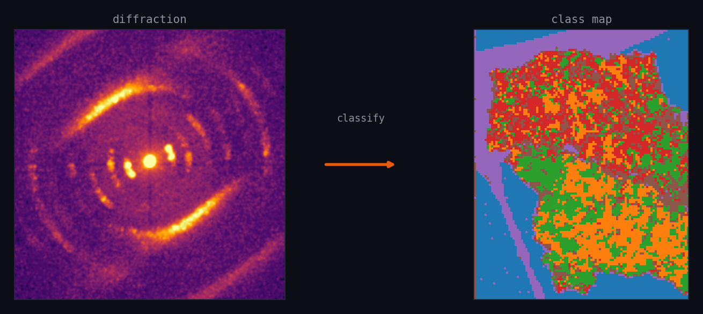
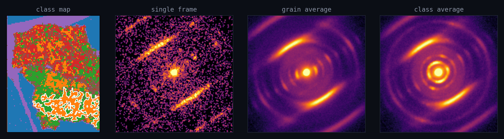

<div align="center">


# DINO-4DSTEM

### A self-supervised deep-learning pipeline for 4D-STEM data analysis.

Unsupervised classification and **phase mapping** for **4D-STEM** (4DSTEM,
four-dimensional STEM) and **scanning electron diffraction (SED)** — also
nanobeam electron diffraction (NBED) and nanodiffraction. It groups your
diffraction patterns into distinct structural regions and shows you **why** —
**no labels, no coding**.

[](https://arxiv.org/abs/2608.15098)


<br>



<br><br>

### **[⬇  Download &amp; install →](INSTALL.md)**

*Free · Windows · a one-time ~15-minute setup, then double-click to run.*

</div>

---

## What it does

Point it at a scan. It groups every diffraction pattern into structurally
distinct classes — phases, crystallinity, texture — paints them on a map of
your sample, and gives you the evidence behind each class.

<table>
<tr>
<td width="33%" valign="top">

### 🔍 Automatic

Groups every diffraction pattern into distinct classes with **no labels and no
hand-tuning**. Just load a scan and go.

</td>
<td width="33%" valign="top">

### 🧭 Interpretable

See *why* each region is its own class — its diffraction as a **single frame**,
a **grain average**, or the **whole class** — plus attribution maps and an
**NMF** baseline to check the answer.

</td>
<td width="33%" valign="top">

### 🖱️ No code

A **desktop app** plus a **plain-English assistant**. Double-click to launch —
or just ask *“load this file, then train.”*

</td>
</tr>
</table>

---

## See the evidence — at any scale

Every class is checkable. Look at its diffraction as a **single frame**, a
**grain average**, or the **whole-class average** — the noise falls away and
the Bragg spots sharpen as you zoom out.

<div align="center">

</div>

---

## Bring your own data

Point it at the files you already have — **nothing is uploaded**, everything
stays on your machine.

| Format | Source / detector | Notes |
|---|---|---|
| `.prz` · `.npz` · `.npy` | py4DSTEM / NumPy cubes | memory-mapped, low RAM |
| `.h5` · `.hdf5` master | Dectris / Eiger / EMPAD masters | stitches external links; asks scan shape if 3-D |
| `.dm4` · `.dm3` | Gatan | reads calibration from metadata |
| `.raw` | EMPAD | metadata rows cropped automatically |
| `.mib` (+ `.hdr`) | Quantum Detectors **Merlin / Medipix3** | counting mode |
| **folder of images** | `.tif` / `.png` / `.jpg` / … | numbered by scan order → cube (greyscale + optional binning) |

---

## Low dose? Denoise it first.

Beam-sensitive samples force you below the dose that gives a clean pattern. The
**Pre-processing** tab now has one-click **self-supervised denoising** — no clean
reference, no repeated acquisition. **One exposure is enough.**

**🌀 Denoise (Noise2Noise, binomial).** Every pattern is a Poisson draw, so a
fair coin flip per electron deals its counts into two *independent* half-dose
exposures of the same signal (Poisson thinning). A small, deliberately
low-capacity **dose-equivariant** network learns to map one half to the other,
then runs on the full exposure. Total counts are preserved — and there is
**no parameter to tune**.

**📉 Flatten (radial background).** Removes the azimuthally-symmetric radial
background — the direct-beam skirt and the amorphous halo — so the Bragg and
orientation signal stands out. Subtract the azimuthal median, or divide by the
azimuthal mean.

Both show a **before/after preview**, then bake a new cube alongside the
original — your raw file is never modified.

> **The other algorithms are in the notebooks.** `n2_methods_demo.ipynb`
> compares **Noise2Void**, **Noise2Self** and **scan-to-scan Noise2Noise**
> against the binomial split — with the math behind each, and why the
> blind-spot methods carry a hyperparameter while the binomial split does not.

---

## Get started — pick your platform

Each bundle is the whole app with the right launchers for your OS. All three
need free **[Miniconda / Miniforge](https://github.com/conda-forge/miniforge#install)**
installed first.

<table>
<tr>
<th align="center">🪟 Windows</th>
<th align="center">🐧 Linux</th>
<th align="center">🍎 macOS</th>
</tr>
<tr valign="top">
<td align="center">

**[⬇ Download for Windows](https://github.com/DanielKhaykelson/dino-4dstem/releases/latest/download/dino-4dstem-windows.zip)**

Double-click `install_1_…bat` then `install_2_…bat`, launch from the Desktop icon.

**[Install guide →](INSTALL.md)**

</td>
<td align="center">

**[⬇ Download for Linux](https://github.com/DanielKhaykelson/dino-4dstem/releases/latest/download/dino-4dstem-linux.zip)**

`chmod +x *.sh` → `./install.sh` → `./launch_gui.sh`. NVIDIA-GPU ready.

**[Install guide →](INSTALL.md#linux--macos)**

</td>
<td align="center">

**[⬇ Download for macOS](https://github.com/DanielKhaykelson/dino-4dstem/releases/latest/download/dino-4dstem-macos.zip)**

`chmod +x *.sh` → `./install.sh` → `./launch_gui.sh`. Runs on CPU.

**[Install guide →](INSTALL.md#linux--macos)**

</td>
</tr>
</table>

> Prefer git? `git clone https://github.com/DanielKhaykelson/dino-4dstem`, then
> run the installer for your OS. The Windows bundle also includes
> **`GETTING_STARTED.docx`**, a picture-by-picture walkthrough.

> ⚠️ **Windows is the primary, fully tested platform.** The **Linux** and
> **macOS** builds share the same code and their installers have been checked,
> but they have **not yet been fully tested end-to-end** on those systems. If
> you hit a problem on Linux or macOS, please [get in touch](#help--contact) —
> reports are very welcome.

---

## Citing

If DINO-4DSTEM contributes to work you publish, please cite the paper:

> **DINO4DSTEM: A self-supervised framework for structural discovery in 4D-STEM**<br>
> Daniel Khaykelson, Lothar Houben, Boris Rybtchinski<br>
> arXiv:2608.15098 (2026) — **[read it →](https://arxiv.org/abs/2608.15098)**

```bibtex
@article{khaykelson2026dino4dstem,
  title  = {DINO4DSTEM: A self-supervised framework for structural discovery in 4D-STEM},
  author = {Khaykelson, Daniel and Houben, Lothar and Rybtchinski, Boris},
  journal = {arXiv preprint arXiv:2608.15098},
  year   = {2026},
  url    = {https://arxiv.org/abs/2608.15098}
}
```

> GitHub also builds this for you: use **“Cite this repository”** on the
> repo sidebar (it reads [`CITATION.cff`](CITATION.cff)) to copy BibTeX or APA.

---

## Learn more

- 📄 **The paper** — [arXiv:2608.15098](https://arxiv.org/abs/2608.15098)
- 🧭 **What it does &amp; results** — [`PROJECT_SUMMARY.md`](PROJECT_SUMMARY.md)
- 📓 **Tutorial notebooks** — [`notebooks/`](notebooks/) — phantom → train → analyse → baselines, plus the **denoising methods** comparison (N2N binomial, Noise2Void, Noise2Self)
- 🧠 **The methods explained** (DINO, NMF, clustering, PCA) — [`docs/assistant/CONCEPTS.md`](docs/assistant/CONCEPTS.md)
- 📕 **Full manual** — [`docs/USER_MANUAL.pdf`](docs/USER_MANUAL.pdf)
- 🛠️ **Install guide** — [`INSTALL.md`](INSTALL.md)

---

## Help &amp; contact

Questions, bug reports, feature requests, or help getting it running on your
data — including **Linux/macOS** issues — are all welcome. Two ways to reach us:

- 🐛 **Bug reports &amp; feature requests:** open a
  **[GitHub issue](https://github.com/DanielKhaykelson/dino-4dstem/issues)**
  (click **New issue**). Best for anything reproducible — it's searchable and
  others can follow along.
- 📧 **Direct questions / inquiries:** email Daniel Khaykelson at
  **[daniel.kh@weizmann.ac.il](mailto:daniel.kh@weizmann.ac.il)**.

When reporting a problem, it helps to include your **operating system**, what
you did, and the **full error message** (copy the text from the console window).

<div align="center">
<br>
<sub>🦕 Windows · Linux · macOS · companion code for ongoing 4D-STEM / electron-diffraction research.</sub>
</div>
